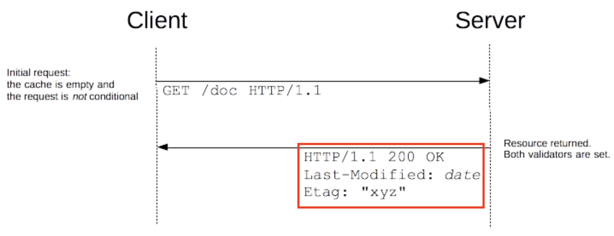
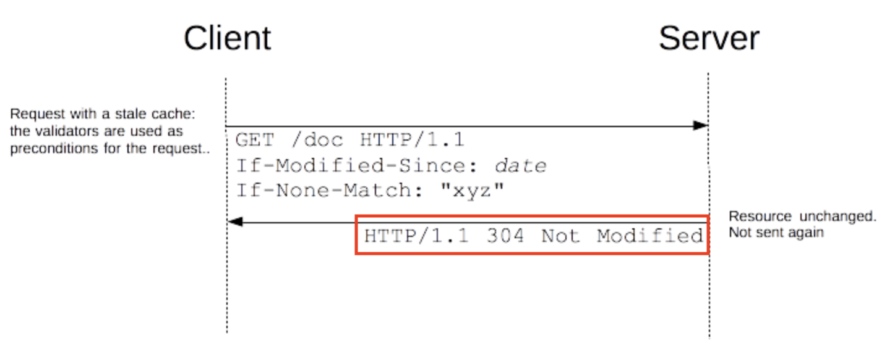
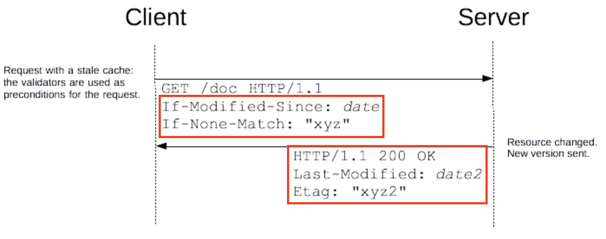

## 핵심 요약

- HTTP Response header
- 버전을 나타내는 `고유한 문자열`(지문처럼 사용)
- `캐시를 관리할 때 주로` 사용, Mid-air collisions를 피하기 위해 사용

## 변경되지 않은 리소스 캐싱 & 캐시 갱신

비어 있는 캐시를 가지고 있거나 혹은 캐시를 가지고 있지 않은 경우, 요청된 리소스는 200 OK의 상태로 회신된다.
Last-Modified, ETag는 그 중 하나만 혹은 둘다 전송될 수 있다. 이 헤더들은 캐시 컨트롤에 사용된다.

유저가 같은 URL 방문 시 변경되지 않은 리소스를 캐시하기 위해 사용. If-None-Match header에 ETag를 담아서 전송하고 서버가 전송된 ETag와 현재 버전 리소스의 ETag와 비교하여 같으면(리소스가 변경되지 않았으면) 304(Not Modified)상태를 body없이 반환(클라이언트가 캐시된 버전 리소스 사용)한다.

리소스가 변경되었다면 서버는 리소스의 새로운 버전(아래 예제에서 `ETag: "xyz" ->"xyz2", Last-Modified: "date" -> "date2"로 변경`)과 함께 200(OK) 응답.

## Avoid mid-air collisions

컨텐츠 수정을 할 때 컨텐츠가 해시되고 ETag가 응답 값을 반환한다. 수정내역을 저장할 때(POST 요청) ETag를 포함한 If-Match haeder로 컨텐츠가 최신 상태인지 확인 가능.

해시가 일치하지 않으면 문서가 중간에 편집되었으며 412(Precondition Failed) 오류 의미

## 참고

- https://developer.mozilla.org/ko/docs/Web/HTTP/Headers/ETag
- https://developer.mozilla.org/ko/docs/Web/HTTP/Conditional_requests
