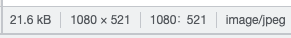

# Image Optimization with Next Static HTML Export

## Summary

💬 [**Next Static HTML Export**](https://nextjs.org/docs/advanced-features/static-html-export) 기능을 사용하면 next/image default loader를 사용할 수 없다.

1. Lazy Load
2. File format
3. (Bonus)Load order

## Background

ℹ️ [**Next Static HTML Export**](https://nextjs.org/docs/advanced-features/static-html-export) 기능을 사용해서 S3에서 서빙되는 프로젝트 예시

## What/Why

### 1. Lazy Load

💡 대부분 이미지(16MB)로 구성된 이벤트 페이지
Lazy load로 유저 viewport에 들어왔을 때만 이미지를 로드
⇒ **페이지 초기 로드 속도 향상**

### 2. File format

💡 webp 지원하는 브라우저에서는 webp 포맷으로 서빙해서 이미지 크기를 줄인다.
⇒ **페이지 초기 로드 속도 향상**\$\$

같은 이미지를 webp로 변환하면 9.6kB, 원본 jpeg은 21.6kB ⇒ **2.25배**




## What’s the Issue?

💬 그럼 [next/image](https://nextjs.org/docs/api-reference/next/image) 쓰면 되겠네요?

### Error

**next image default loader는 next export에서 사용할 수 없다.**

```tsx
Error: Image Optimization using Next.js' default loader is not compatible with `next export`.
  Possible solutions:
    - Use `next start` to run a server, which includes the Image Optimization API.
    - Configure `images.unoptimized = true` in `next.config.js` to disable the Image Optimization API.
  Read more: https://nextjs.org/docs/messages/export-image-api
```

> You are attempting to run `next export` while importing the `next/image` component using the default `loader` configuration.
> However, **the default `loader` relies on the Image Optimization API** which is **not available for exported applications**.

[export-image-api | Next.js](https://nextjs.org/docs/messages/export-image-api)

### Document

문서에 **next image default loader는 next export에서 사용할 수 없다**고 명시되어있다.

> **[Supported Features](https://nextjs.org/docs/advanced-features/static-html-export#supported-features)**
>
> • [Image Optimization](https://nextjs.org/docs/basic-features/image-optimization) using a [**custom loader**](https://nextjs.org/docs/basic-features/image-optimization#loaders) 
> 
> **[Unsupported Features](https://nextjs.org/docs/advanced-features/static-html-export#unsupported-features)**
> 
> • [Image Optimization](https://nextjs.org/docs/basic-features/image-optimization) (**default loader**)

[Advanced Features: Static HTML Export | Next.js](https://nextjs.org/docs/advanced-features/static-html-export#next-export)

### Loaders?

> A loader is a function that generates the URLs for your image. It modifies the provided `src`
> , and generates multiple URLs to request the image at different sizes. These multiple URLs are used in the automatic [srcset](https://developer.mozilla.org/en-US/docs/Web/API/HTMLImageElement/srcset) generation, **so that visitors to your site will be served an image that is the right size for their viewport.**

> The default loader for Next.js applications uses the built-in Image Optimization API, which optimizes images from anywhere on the web, and then **serves them directly from the Next.js web server**. If you would like to serve your images directly from a CDN or image server, you can write your own loader function with a few lines of JavaScript

- **Loader는 image url을 생성하는 함수**다. 자동으로 [srcset](https://developer.mozilla.org/en-US/docs/Web/API/HTMLImageElement/srcset)을 만들어줘서 방문자의 viewport 사이즈에 맞게 이미지를 서빙할 수 있다.
- **Next export 사용 시 Next.js web server를 사용하지 않는다. ⇒ default loader가 동작하지 않음.**

[Basic Features: Image Optimization | Next.js](https://nextjs.org/docs/basic-features/image-optimization#loaders)

### Custom Loader

원한다면 Loader를 설정할 수 있음. CDN 별 query string이 다른 경우 유용할 듯.

Next export를 사용하면 유저의 Device Size를 알 수 없기 때문에 [Default Device Sizes](https://nextjs.org/docs/api-reference/next/image#device-sizes) 중 가장 큰 3840으로 **width가 url에 세팅된다. ⇒ query string으로 width를 변경하는 이미지 서버가 아니면 의미 없음.**

```tsx
module.exports = {
  images: {
    loader: "custom",
    loaderFile: "./my/image/loader.js",
    // Default
    deviceSizes: [640, 750, 828, 1080, 1200, 1920, 2048, 3840],
  },
};
```

```tsx
export default function myImageLoader({ src, width, quality }) {
  return `https://example.com/${src}?w=${width}&q=${quality || 75}`;
}
```

- https://nextjs.org/docs/api-reference/next/image#device-sizes
- https://nextjs.org/docs/api-reference/next/image#loader-configuration

## Conclusion(How to resolve)

아래 옵션 추가해서 해결. File format 기능은 사용할 수 없지만 img 태그 대신 next/image를 사용하면 Lazy load는 사용할 수 있음.

```tsx
images: {
  unoptimized: true,
},
```

위 방법으로 아래 결과

1. Lazy Load - O
2. File format - X
3. Load order - O

## Bonus

### 3. Load order

position: fixed, absolute한(이하 Floating) FAB, CTA 버튼에 이미지가 들어가는 경우

💡 DOM Tree 하단에 있을 경우 상단의 이미지가 로드된 이후에 로드되기 때문에 (옮길 수 있다면) Floating된 Image를 DOM Tree 상단으로 옮겨서 이미지가 늦게 나오는 현상 방지
⇒ **UX 개선**


## References

- https://nextjs.org/docs/advanced-features/static-html-export
- https://nextjs.org/docs/messages/export-image-api
- https://developer.mozilla.org/en-US/docs/Web/API/HTMLImageElement/srcset
