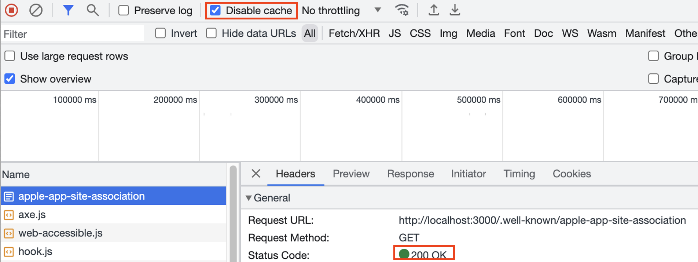
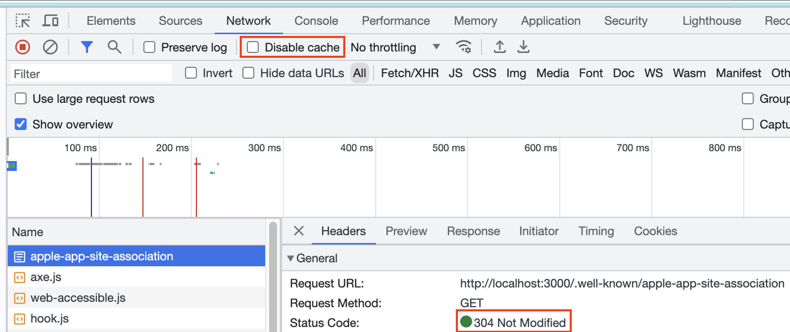

## 이슈

iOS App Deeplink를 위해 .well-known/apple-app-site-association 파일을 업로드해야되는 경우 .json 확장자를 사용하면 안됨(애플 공식문서)

> Don’t append `.json` to the `apple-app-site-association` filename.

**Response Header를 변경 안하면 파일 경로로 접근 시 json이 return되지 않고 파일이 다운로드 됨.**

## 해결

next.config.js에서 파일 경로의 Response header를 변경

```tsx
/** @type {import('next').NextConfig} */
const nextConfig = {
  async headers() {
    return [
      {
        source: "/.well-known/apple-app-site-association",
        headers: [
          {
            key: "Content-Type",
            value: "application/json",
          },
        ],
      },
    ];
  },
};

module.exports = nextConfig;
```

## 주의

Header를 변경해도 브라우저에서 같은 경로의 Response header를 Caching하고 있는 경우 Header가 안바뀐 것처럼 동작할 수 있으므로 **Browser 개발자 도구에서 Disable cache를 활성화하고 테스트하는 것을 권장**

Disable cache를 활성화하지 않은 경우 Status Code 304. Response header도 변경되지 않음.



Disable cache를 활성화한 경우 Status Code 200. 매 요청마다 Response header가 변경됨


## Reference

- https://nextjs.org/docs/app/api-reference/next-config-js/headers
- https://developer.apple.com/library/archive/documentation/General/Conceptual/AppSearch/UniversalLinks.html#//apple_ref/doc/uid/TP40016308-CH12-SW4
- https://sangheon.com/%EC%9C%A0%EB%8B%88%EB%B2%84%EC%84%A4-%EB%A7%81%ED%81%AC-universal-links/
