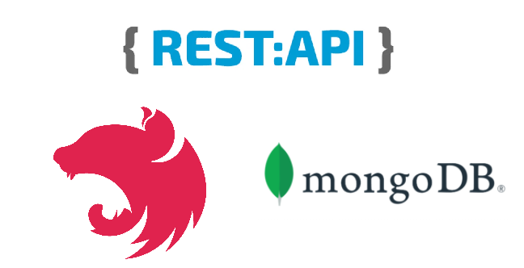

## 무엇을 만들 것인가?

REST API를 NestJS를 사용해서 만들어본다.

## REST API?

> REST API가 뭔가요?

간단하게 현재(2021년 기준) 서비스를 만들 때 가장 많이 사용하는 HTTP 아키텍처입니다.

아래 참고의 좋은 글들을 참고하세요.

> 요즘 GraphQL도 있다는데 왜 REST API에요?

장단점이 있어서 서비스에 적절한 방법을 사용하는 것을 추천합니다.

### 장점

- 위에서 언급했듯이 가장 범용적으로 사용하고 구현이 간단하다.
- URI로 정보의 자원을 표현 가능
- [HTTP 상태 코드](https://developer.mozilla.org/ko/docs/Web/HTTP/Status)로 예외처리 가능

### 단점

- Over fetching(불필요한 데이터를 받는 경우), Under fetching(data를 end point 하나로 못받아서 end point를 여러개 사용해야하는 경우) 등
- 위 문제점 개선을 위해 프론트엔드 개발자와 백엔드 개발자가 커뮤니케이션하고 UI에 맞게 API를 수정하는 비용

위 단점을 해결하기위해 나온게 GraphQL인데 GraphQL도 장단점이 있으며 상황에 맞는 선택을 하시길 바랍니다.

## NodeJS?

> Java Spring, PHP Laravel 있잖아요?

프론트엔드에게 편안한 Javascript, NodeJS 환경에서 개발하고 싶었고

[왜 우리는 Go와 TypeScript를 선택했는가](https://medium.com/daangn/%EC%99%9C-%EC%9A%B0%EB%A6%AC%EB%8A%94-go%EC%99%80-typescript%EB%A5%BC-%EC%84%A0%ED%83%9D%ED%96%88%EB%8A%94%EA%B0%80-3c08a4cf7ca8) 이 글과 비슷하게 생각합니다.

## NestJS?

NodeJS 환경에서 백엔드를 개발하면 가장 많이 듣게 되는게 Express일 것입니다. Express로 개발하면 소규모 프로젝트에서는 적은 코드로 빠르게 개발이 가능해서 좋지만 프로젝트 규모가 커지면 어떤 폴더에 어떤 파일을 넣지? 라는 구조에 대한 고민을 하게 됩니다. [NestJS의 Philosophy](https://docs.nestjs.com/#philosophy)를 읽어보면 이 문제를 해결하기 위한 철학을 가지고 있는 것을 알 수 있습니다.

> NodeJS에서 다른 대안은 없나요?

https://feathersjs.com/가 있습니다. 이 역시 라이브러리의 철학([Why should I use Feathers?](https://docs.feathersjs.com/help/faq.html#why-should-i-use-feathers), [Why we built the best web framework you’ve probably never heard of (until now).](https://blog.feathersjs.com/why-we-built-the-best-web-framework-you-ve-probably-never-heard-of-until-now-176afc5c6aac))을 보면 같은 문제(API 개발)을 다른 철학을 가지고 해결하는 것을 알 수 있습니다. NestJS로 Hello world 출력하는데 왜 이렇게 많은 파일과 코드가 필요하냐고(마치 Java의 Spring) 느끼는 분들에게는 좋은 대안일 수 있을 것 같습니다.

다음 글에서 더 자세히 언급하겠지만 모든 폴더와 파일을 직접 만들고 코드를 직접 써야된다면 저 역시 불편함을 느꼈을 것 같지만 [CRUD generator](https://docs.nestjs.com/recipes/crud-generator#crud-generator)를 통해서 빠르게 개발해보니 괜찮은 라이브러리라고 생각해서 소개하게되었습니다.

## 참고

- [REST API 제대로 알고 사용하기](https://meetup.toast.com/posts/92)
- [REST API(RESTful API, 레스트풀 API)란? 구현 및 사용법](https://www.redhat.com/ko/topics/api/what-is-a-rest-api)
- https://graphql.org/
- [GraphQL vs REST - A comparison](https://www.howtographql.com/basics/1-graphql-is-the-better-rest/)
- [HTTP 상태 코드](https://developer.mozilla.org/ko/docs/Web/HTTP/Status)
- [왜 우리는 Go와 TypeScript를 선택했는가](https://medium.com/daangn/%EC%99%9C-%EC%9A%B0%EB%A6%AC%EB%8A%94-go%EC%99%80-typescript%EB%A5%BC-%EC%84%A0%ED%83%9D%ED%96%88%EB%8A%94%EA%B0%80-3c08a4cf7ca8)
- https://docs.nestjs.com/#philosophy
- https://docs.feathersjs.com/help/faq.html#why-should-i-use-feathers
- https://blog.feathersjs.com/why-we-built-the-best-web-framework-you-ve-probably-never-heard-of-until-now-176afc5c6aac
- https://github.com/qvil/nest-rest
