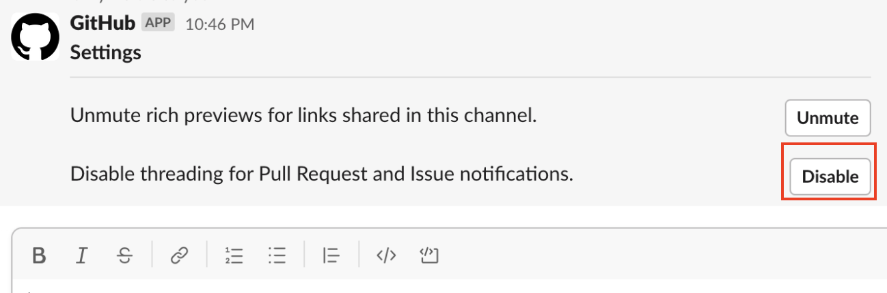

## Github Slack Integration하면 Comment Noti가 안와서 불편한데 아래와 같이 추가 설정하면됨.

## Default로 Noti 주는건 아래

- `issues` - Opened or closed issues
- `pulls` - New or merged pull requests, as well as draft pull requests marked "Ready for Review"
- `commits` - New commits on the default branch (usually `master`)
- `releases` - Published releases

## 더 추가 가능한 것

- `reviews` - Pull request reviews
- `comments` - New comments on issues and pull requests
- `branches` - Created or deleted branches
- `commits:*` - All commits pushed to any branch
- `+label:"your label"` - Filter issues, pull-requests and comments based on their labels.

## 모든 알람 받기 예시

```tsx
/github subscribe owner/repo reviews comments branches commits:*
```

## Comment 알림이 Thread로 오는 기능을 끄는 방법

> Comment 알림이 Thread로 오는 경우 팔로잉이 안되는 경우가 있어서 불편하다.

### 아래 이슈에서 많은 토론이 있었고

[https://github.com/integrations/slack/issues/1500](https://github.com/integrations/slack/issues/1500)

### Collaborator가 설정이 추가되었다고 말했고 이걸로 해결했다.

`/github settings` 명령어를 슬랙에 입력하면 아래 화면이 뜨는데 해당 기능을 Disable하면 된다.



[Option for disabling threading feature · Issue #1500 · integrations/slack](https://github.com/integrations/slack/issues/1500#issuecomment-1335564029)

## Reference

- https://github.com/integrations/Slack#configuration