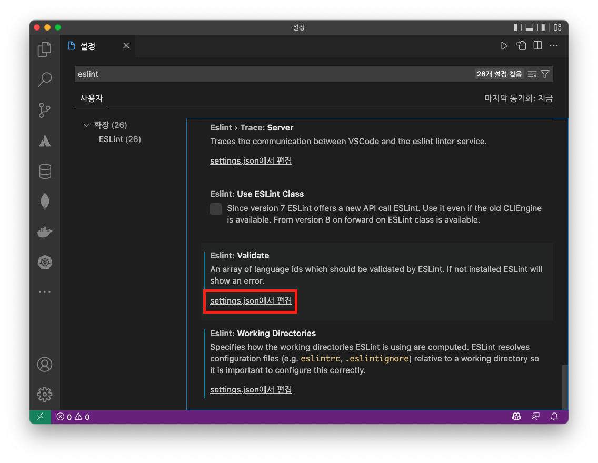

## settings.json에 아래 없으니까 적용 안되고 있었음.

### 1. 설정(cmd + ,)



### 2. settings.json에 아래 코드 추가

```json
"eslint.validate": [
  "typescript",
  "typescriptreact",
  "javascript",
  "javascriptreact"
],
```

## References

[ESLint in VSCode not fixing on save](https://stackoverflow.com/a/68016089/19090260)
