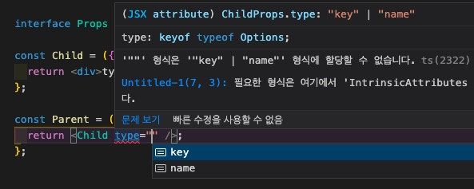

## Object의 Key를 Type으로 사용하려면 keyof typeof Object

```tsx
const MyObject = {
  key: "key",
  name: "name",
};

interface ChildProps {
  type: keyof typeof MyObject;
}

const Child = ({ type }: ChildProps) => {
  return <div>type: {type}</div>;
};

const Parent = () => {
  return <Child type="name" />;
};
```


