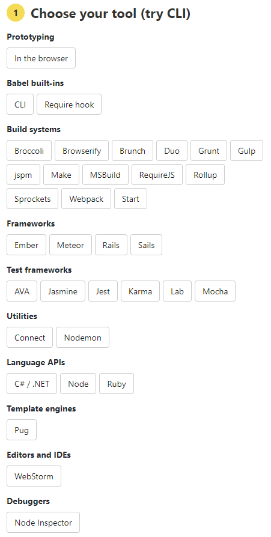

## Typescript가 ES6+문법을 ES5- Javascript로 변환해준다면 Babel은 필요한가?

> **상황에 따라 다름.** 아래 구체적인 설명

### Babel vs `tsc` for TypeScript

- Build output이 source input files과 비슷하면 `tsc`사용
- 다양한 Build pipeline이 필요하면 `Babel`을 사용해서 transpiling 후 `tsc`로 타입 체크

https://www.typescriptlang.org/docs/handbook/babel-with-typescript.html

---

## Typescript with Babel

### 하나의 컴파일러 관리

[ts-node](https://github.com/TypeStrong/ts-node), [ts-jest](https://github.com/kulshekhar/ts-jest), [ts-karma](https://github.com/monounity/karma-typescript), [create-react-app-typescript](https://github.com/wmonk/create-react-app-typescript) 등 여러가지 컴파일러 커스터마이징 해서 사용하는 대신 Babel로 해결 가능.

https://babeljs.io/en/setup



### Babel로 위에서 언급한 다양한 구성(Multiple potential pipeline) 사용

#### Optional chaining, Macro, ...etc

- (2021-04-19기준) Typescript v3.7에서 지원한다. => 더이상 이유가 아님. [참고](https://www.typescriptlang.org/docs/handbook/release-notes/typescript-3-7.html)

- https://github.com/jgierer12/awesome-babel-macros를 참고하여 다양한 Babel macro를 사용하는 경우(난 사용 안해봤지만 Typescript에서 지원하지 않는 기능이 Babel에 있다는게 핵심.)

#### 빠른 컴파일

1. Babel은 Typescript 코드를 **제거**한다.
2. 1.의 이유로 Typescript의 Dev/Watch mode의 느린 컴파일 속도 대신 빠른 컴파일 가능.
3. 위 이유로 Babel + Typescript 환경에서 코드 수정 시 항상 빌드하지 않아서 에러를 출력하지 않고 컴파일 시간을 낭비할 필요가 없다. (Hot reloading 시 항상 Type check 안하는 현상, _개발 모드에서 동작하지만 Build해서 타입 에러 생길 수 있으니 주의_)

> `isolatedModules` 플래그 활성화하면 타입스크립트는 위 문제를 미리 경고해준다.

tsconfig.json

```
{
  "compilerOptions": {
    "isolatedModules": true // Ensure that each file can be safely transpiled without relying on other imports.
  }
}
```

#### 환경 변수에 따른 다양한 구성

.babelrc

```
{
  "env": {
    "development": {
      "plugins": [
        [
          "styled-components",
          { "ssr": true, "displayName": true, "preprocess": false }
        ]
      ],
      "presets": ["next/babel"]
    },
    "production": {
      "plugins": [
        [
          "styled-components",
          { "ssr": true, "displayName": false, "preprocess": false }
        ]
      ]
    }
  }
}
```

### Babel for Transpiling, tsc for Type check

- Babel은 Transpiling할 때 Type check를 할 수 없다.
- Babel은 Transpiling할 때 `.d.ts`를 만들 수 없다. 라이브러리 만드는 경우 Babel만으로는 어려울 수 있다.

tsconfig.json

```
{
  "compilerOptions": {
    "declaration": true // Generate .d.ts files from TypeScript and JavaScript files in your project.
  }
}
```

## 참고

- https://www.typescriptlang.org/docs/handbook/babel-with-typescript.html
- https://iamturns.com/typescript-babel/
- https://ui.toast.com/weekly-pick/ko_20181220
- https://stackoverflow.com/questions/44020689/why-would-i-use-typescript-and-babel-together
- https://typescript-kr.github.io/pages/tutorials/babel-with-typescript.html
