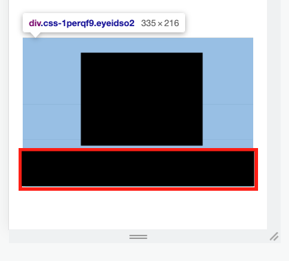
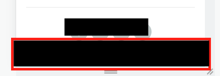
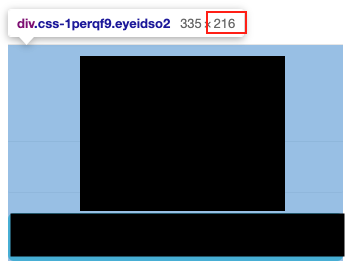
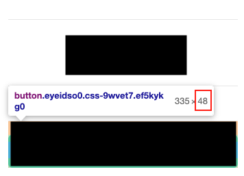

## ℹ️ Target이 Viewport에 들어왔는지 확인하는 API

- 페이지 스크롤 중 Lazy load
- Infinite scroll
- 광고 수익 계산
- 사용자에게 표시 여부에 따른 작업

## [Intersection observer options](https://developer.mozilla.org/en-US/docs/Web/API/Intersection_Observer_API#creating_an_intersection_observer)

1. `root` - Visibility viewport로 사용할 target이고 반드시 target의 조상(부모)이어야 한다. **지정하지 않거나 null인 경우** (**Default: Browser [viewport](https://developer.mozilla.org/en-US/docs/Glossary/Viewport)**)
2. `rootMargin` - root의 margin이고 CSS Margin과 같은 방향(top, right, bottom, left)으로 설정((px, 백분율) 가능하다. (**Default: 0**)
3. `threshold` - number | number[], 타겟의 Visibility percent. (**Default: 0**)
   1. 0: 1 px이라도 보이면 콜백 실행
   2. 1: 모든 px이 보여야 콜백 실행
   3. [0, 0.25, 0.5, 0.75, 1]: 25% 보일 때마다 콜백 실행

## [useIntersection](https://github.com/streamich/react-use/blob/master/docs/useIntersection.md) 예제

- 파란색 영역이 intersectionRef
- 빨간 박스가 visible 체크 영역

1. 빨간 영역이 완전히 안보이면(파란 영역에서 빨간 영역을 뺀 값(rootMargin) 간격을 지난 **타겟이 1px이라도 안보이면**) 오른쪽 Fixed 버튼으로 변경
   
2. 위 파란 영역에서 빨간 영역을 뺀 값(rootMargin) 간격을 지난 **타겟이 1px이라도 보이면** 위 버튼으로 변경
   
3. rootMargin은 파란 영역에서 빨간 영역을 뺀 값.
   1. 216 - 48 = 168
      
      
   2. top을 기준으로 반대인 bottom 방향으로 margin을 주기 때문에 -(minus)px
4. 빨간 영역을 target으로 잡지 않는 이유는 isIntersecting state에 따라 conditional rendering하기 때문에 DOM 자체가 사라지면 target이 사라져 intersection에 null이 반환된다


```tsx
const applyButtonMargin = "-168px";
const intersection = useIntersection(intersectionRef, {
  root: null,
  rootMargin: applyButtonMargin,
  threshold: 0,
});
```

## References

- https://developer.mozilla.org/en-US/docs/Web/API/Intersection_Observer_API
- https://developer.mozilla.org/en-US/docs/Glossary/Viewport
