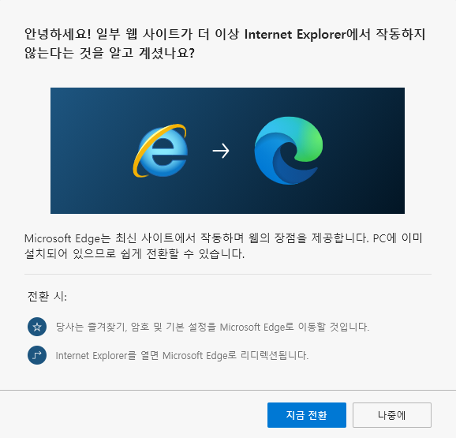

## 문제 인식

> The Internet Explorer 11 desktop application will be retired on June 15, 2022

[The future of Internet Explorer on Windows 10 is in Microsoft Edge](https://stackoverflow.com/questions/63404573/how-to-redirect-from-internet-explorer-to-microsoft-edge-seamlessly)

Microsoft에서 Internet Explorer(이하 IE) 지원을 중단한건 한참 되었고 **Retire**란 단어를 쓰면서 지원중단을 공표했다.

웹 개발자들은 웹 표준을 따르지 않는 IE 때문에 개발할 때 상당히 고생하고 특히 한국에서는 IE를 위한 크로스 브라우징 경험을 요구하는 경우도 있었다.

## 해결

### [Prerequisites](https://docs.microsoft.com/en-us/deployedge/edge-learnmore-neededge#prerequisites)

- Microsoft Edge Stable version 87 or later
- Windows versions
  - Windows 10 version 1709 or later
  - Windows 8.1
  - Windows 7

핵심은 아래 스크립트 이다.

```js
<script>
  if(/MSIE \d|Trident.*rv:/.test(navigator.userAgent)) {
    window.location = 'microsoft-edge:' + window.location;
    setTimeout(function() {
      window.location = 'https://go.microsoft.com/fwlink/?linkid=2135547';
    }, 1);
  }
</script>
```

이 스크립트를 웹사이트의 최상단에 넣으면 IE로 웹사이트 접근 시 안내 페이지로 리다이렉트 되고 엣지에서 웹사이트가 아래 팝업과 함께 열린다.



1. 하지만 이 스크립트에 나온 URL(https://go.microsoft.com/fwlink/?linkid=2135547) 을 사용할 경우 리다이렉트 되는 페이지의 문장(`이 웹 사이트가 Internet Explorer에서 작동하지 않음`)이 너무 강력하다.
1. Facebook, Stackoverflow 등 다른 웹 사이트들이 해결한 방법을 찾아보니 더 부드러운 문장(`이 웹 사이트는 Microsoft Edge에서 더 잘 작동합니다.`)을 사용한 URL(https://support.microsoft.com/office/160fa918-d581-4932-9e4e-1075c4713595) 로 리다이렉트 시킨다.

그래서 2번 URL(https://support.microsoft.com/office/160fa918-d581-4932-9e4e-1075c4713595) 을 적용했다.

## Next.js Version

\_document.tsx

```ts
redirectIEToEdge = () => {
	const recommendEdgeUrl =
	  "https://support.microsoft.com/office/160fa918-d581-4932-9e4e-1075c4713595";
	return (
	  <script
	    dangerouslySetInnerHTML={{
	      __html: `if(/MSIE \d|Trident.*rv:/.test(navigator.userAgent)) {
	      window.location = 'microsoft-edge:' + window.location;
	      setTimeout(function() {
	        window.location = '${recommendEdgeUrl}';
	      }, 1);
	    }`,
	    }}
	  ></script>
	);
	};

render() {
  const {
    redirectIEToEdge,
  } = this;

  <Html>
    <Head>
      {redirectIEToEdge()}
```

## 여담

이 기능을 왜 찾아보고 적용했는지 생각해보니 Microsoft Edge team에서 먼저 이메일로 연락이 왔다. 그들은 상위 사이트에 연락을 하고 있고 IE를 Edge로 Seamlessly하게 전환하는 것을 도와주겠다고 했다. 근데 그냥 마케팅 담당자에게 메일 전달하고 알아서 문서보고 찾아서 적용했다. 트래픽이 많은 회사를 다니니까 신기한 경험을 했다고 생각했다. 위 내용은 https://aggro.op.gg/ 에 적용되어있다.

## 참고

- https://docs.microsoft.com/en-us/microsoft-edge/web-platform/ie-to-microsoft-edge-redirection
- https://stackoverflow.com/questions/63404573/how-to-redirect-from-internet-explorer-to-microsoft-edge-seamlessly
- https://xetown.com/tips/1503837
- https://docs.microsoft.com/ko-kr/deployedge/edge-learnmore-neededge#policies-to-configure-redirection-to-microsoft-edge
